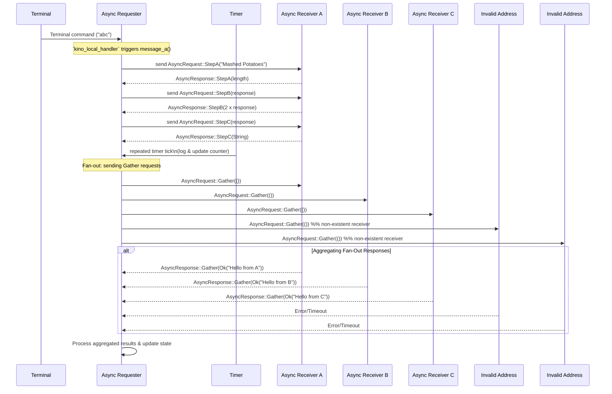

# 🔥🚀🤘 Kinode Processes 2.0 🔥🚀🤘

Shoutout to Doria (@dr-frmr) for the initial app idea, this is just a lot of sugar on top.

## Overview

Key Macros:

- `erect!` – Defines and exports your process: name, icon, HTTP/WS endpoints, handlers, and initialization logic.
- `declare_types!` – Declares strongly typed request/response enums for your message flows.
- `send_async!` – Sends a request with an optional callback, timeout, and on-timeout behavior.
- `fan_out!` – Sends multiple requests in parallel and aggregates their results into a single callback.
- `timer!` – Creates a timer that will invoke a callback after a specified duration.

## Declaring and Erecting Your App

The `erect!` macro is your main entry point.

```rust
use kinode_app_common::{erect, Binding, State};
use kinode_process_lib::http::server::{HttpBindingConfig, WsBindingConfig};
use kinode_process_lib::{Message, kiprintln};

fn init_fn(state: &mut MyState) {
    kiprintln!("Initializing My Cool Process!");
    // Optionally schedule timers, run initial tasks, etc.
}

/// Example local handler for messages sent within the same node
fn my_local_handler(
    _message: &Message,
    _state: &mut MyState,
    _server: &mut kinode_process_lib::http::server::HttpServer,
    request: SomeLocalRequestType,
) {
    kiprintln!("Received local request: {:?}", request);
    // ...
}

erect!(
    // The name displayed in logs or UI
    name: "My Cool Process",

    // Optional icon for a GUI environment
    icon: Some("icon-identifier"),

    // Optional widget name for embedding in a UI
    widget: None,

    // Optional HTTP config for serving a UI at path "/"
    ui: Some(HttpBindingConfig::default()),

    // HTTP/WS endpoints
    endpoints: [
        Binding::Http {
            path: "/api",
            config: HttpBindingConfig::default(),
        },
        Binding::Ws {
            path: "/ws",
            config: WsBindingConfig::default(),
        },
    ],

    // Handlers for different message classes
    handlers: {
        // For HTTP API calls
        api: my_http_handler_function,

        // For local (same-node) messages
        local: my_local_handler,

        // For remote messages (from other nodes)
        remote: _,

        // For WebSocket messages
        ws: _,
    },

    // Initialization function
    init: init_fn
);
```

### Handler Parameters

Each handler receives:

- A Message object for raw metadata.
- A mutable reference to your State.
- A reference to the process’s HTTP server (so you can respond or manipulate connections).
- A typed request object, which you define (e.g., SomeLocalRequestType).
- Use `_` if you have no need for that particular type of message. Just make sure to at least declare one handler, or the macro will crash (and your process does nothing).

## Defining State

Every process has some notion of application state. You define a struct that implements the State trait:

```rust
#[derive(Debug, Serialize, Deserialize)]
pub struct MyState {
    pub counter: u64,
}

impl State for MyState {
    fn new() -> Self {
        Self { counter: 0 }
    }
}
```

## Declaring Messaging Types

The declare_types! macro lets you define strongly typed request-response pairs. For example:

```rust
use kinode_app_common::declare_types;

declare_types! {
    Async {
        StepA String => i32
        StepB i32 => u64
        StepC u64 => String
        Gather () => Result<String, String>
    },
    Commodore {
        Power SomeStruct => SomeOtherStruct
        Excitement i32 => Result<String, String>
    },
}
```

This expands into something like:

```rust
#[derive(Debug, Serialize, Deserialize, Clone)]
pub enum Req {
    Async(AsyncRequest),
    Commodore(CommodoreRequest),
}

#[derive(Debug, Serialize, Deserialize, Clone)]
pub enum AsyncRequest {
    StepA(String),
    StepB(i32),
    StepC(u64),
    Gather(()),
}

#[derive(Debug, Serialize, Deserialize, Clone)]
pub enum AsyncResponse {
    StepA(i32),
    StepB(u64),
    StepC(String),
    Gather(Result<String, String>),
}

#[derive(Debug, Serialize, Deserialize, Clone)]
pub enum CommodoreRequest {
    Power(SomeStruct),
    Excitement(i32),
}

#[derive(Debug, Serialize, Deserialize, Clone)]
pub enum CommodoreResponse {
    Power(SomeOtherStruct),
    Excitement(Result<String, String>),
}
```

**Convention: If you define <Name>Request, the framework expects a corresponding <Name>Response. Each request variant has exactly one matching response variant, ensuring your callbacks get the right type automatically.**

## Async Sends

Once you have your request/response enums, you can easily invoke another process with send_async!. This macro:

- Serializes your request.
- Sends it to the target address.
- Registers a callback that is executed when the matching response arrives.
- Optionally sets a timeout (in seconds).
- Optionally runs an on_timeout block if no response is received in time.
- Example (showing partial usage of optional timeout and callback):

```rust
use kinode_process_lib::Address;
use proc_macro_send::send_async; // re-export from kinode_app_common

fn message_a(state: &mut MyState) {
    // We'll send "StepA" to the remote "Async Receiver A".
    // If a response arrives before 20 seconds, run the callback block.
    // If it times out, run the `on_timeout` block.
    send_async!(
        Address::new("our", "async-receiver-a", "async-app", "template.os"),
        AsyncRequest::StepA("Mashed Potatoes".to_string()),
        (resp, st: MyState) {
            // This callback is invoked on success with the typed response
            on_step_a(resp, st);
        },
        20,
        on_timeout => {
            kiprintln!("Request StepA timed out!");
        }
    );
}

fn on_step_a(response: i32, state: &mut MyState) {
    kiprintln!("Sender: Received response: {}", response);
    kiprintln!("Sender: State: {}", state.counter);
    state.counter += 1;

    // Chain to Step B
    send_async!(
        Address::new("our", "async-receiver-a", "async-app", "template.os"),
        AsyncRequest::StepB(response),
        (resp, st: MyState) {
            on_step_b(resp, st);
        },
    );
}

fn on_step_b(response: u64, state: &mut MyState) {
    kiprintln!("Sender: StepB response => {}", response);
    state.counter += 1;
    // ...
}
```

## Fan-out / Aggregation

Sometimes you want to send multiple requests in parallel, gather all responses, and then run a single callback. This is what the fan_out! macro does:

```rust
use kinode_app_common::fan_out;
use kinode_process_lib::Address;

fn fanout_message(state: &mut MyState) {
    let addresses: Vec<Address> = vec![
        Address::new("our", "async-receiver-a", "async-app", "template.os"),
        Address::new("our", "async-receiver-b", "async-app", "template.os"),
    ];

    let requests: Vec<AsyncRequest> = vec![
        AsyncRequest::Gather(()),
        AsyncRequest::Gather(()),
    ];

    // We'll wait up to 5 seconds for each sub-request
    fan_out!(
        addresses,
        requests,
        (all_results, st: MyState) {
            kiprintln!("Fan-out complete => subresponses: {:#?}", all_results);
            st.counter += 1;
        },
        5
    );
}
```

Every request in requests is sent to the corresponding item in addresses.
If a request times out or fails to send, it contributes an Err(...) to all_results.
Once all requests are finished (or errored), the (all_results, st: MyState) { ... } block runs.

## Timers

Easily schedule recurring or one-off timers with the timer! macro. For example:

```rust
use kinode_app_common::timer;

fn repeated_timer(state: &mut MyState) {
    // Do something, e.g. log your current counter
    kiprintln!("Timer fired! Counter = {}", state.counter);

    // Maybe increment state
    state.counter += 1;

    // Schedule the next timer
    timer!(3000, (st: MyState) {
        // This block will run in 3 seconds
        repeated_timer(st);
    });
}
```

## Example Flow

My university teacher that hasn't produced anything meaningful in 25 years always told us that we should always draw diagrams. So here is a diagram.


